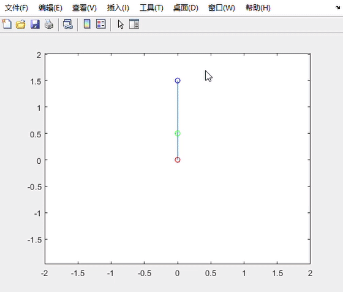
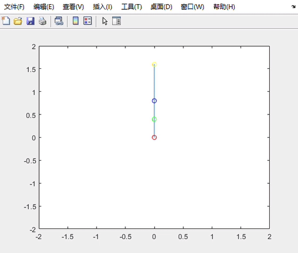
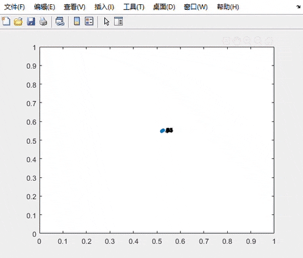
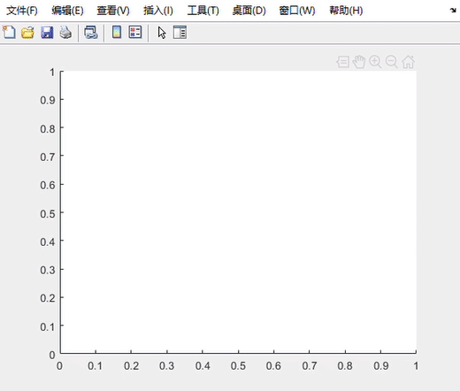
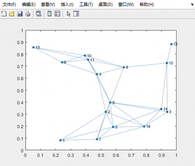
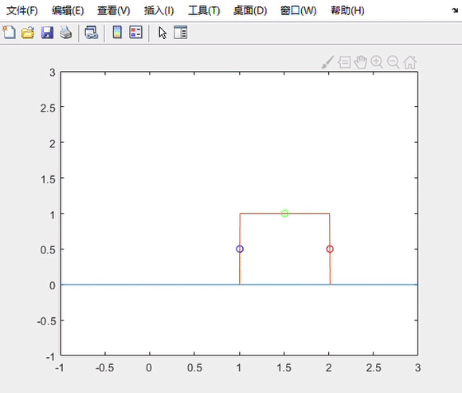

## Robotics Gallary
* toy projects from my winter holiday 2018-2019

1. acrobot: 2-link and 3-link acrobot swing-up using trajectory optimization;
   * 2-link acrobot swing up:
  
     
   * 3-link acrobot swing up:
  
     
  
2. rendezvous: formation control in different settings;
   * rendezvous(let all robot meet at same point):
  
     
  
   * formation control with dynamical underlying graphs(circle):
  
      

   * role assignment with multiple shape formation control:

     
3. walker: trajectory optimization for a 3-link simple walker;

   * walking behaviour for a 3-link robot:

     

### Dependencies

1. OptimTraj: to run all trajectory optimization toys, you need the MATLAB library. can be found here: https://github.com/MatthewPeterKelly/OptimTraj
2. Hungarian Algorithm for Linear Assignment Problems(V2.3): to run role assignment with formation control, you need this library to perform the Hungarian Algorithm. can be found here: https://www.mathworks.com/matlabcentral/fileexchange/20652-hungarian-algorithm-for-linear-assignment-problems-v2-3

Wish you having a good time with these toys. 