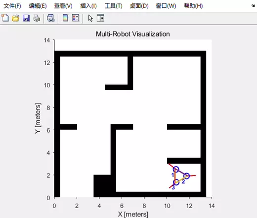

## Robotics Gallary
* toy projects from my winter holiday 2018-2019
* term project for ME740 intelligent mechanics course at Boston University
  
1. acrobot: 2-link and 3-link acrobot swing-up using trajectory optimization;
   * 2-link acrobot swing up:
  
     
   * 3-link acrobot swing up:
  
     
  
2. rendezvous: formation control in different settings;
   * rendezvous(let all robot meet at same point):
  
     
  
   * formation control with dynamical underlying graphs(circle):
  
      

   * role assignment with multiple shape formation control:

     
3. walker: trajectory optimization for a 3-link simple walker;

   * walking behaviour for a 3-link robot:

     

4. mysim: multi-robot simulation environment;

   * virtual structure triangular formation control for 3 robots

     
### Dependencies

1. MATLAB: you need a base version of MATLAB to run the programs, no particular toolbox is required. 
2. OptimTraj: to run all trajectory optimization toys, you need the MATLAB library. can be found here: https://github.com/MatthewPeterKelly/OptimTraj
3. Hungarian Algorithm for Linear Assignment Problems(V2.3): to run role assignment with formation control, you need this library to perform the Hungarian Algorithm. can be found here: https://www.mathworks.com/matlabcentral/fileexchange/20652-hungarian-algorithm-for-linear-assignment-problems-v2-3

* To run scripts in mysim:
1. Robotics System Toolbox from MATLAB;
2. Mobile Robotics Simulation Toolbox from MATLAB
3. icp and hungarian algorithm from community is included in the lib folder. 

### Run the Experiments

1. Acrobots
   The acrobots are classical examples of underactuated robots. In the code here, I used trajectory optimization method to swing up two kinds of acrobots from bottom to top. The MATLAB library for trajectory optimization is an open-sourced project called 'OptimTraj' by Matthew Kelly. To use OptimTraj, you simply need to download it and add it to your MATLAB's search path(right click on folder and 'add to path'). Also, animation scripts are useful for understanding the solution. For a lengthy explanation of theories and methods, you can refer to my notes on the topic at https://arxiv.org/abs/1901.03952. 
   To create an acrobot animation like I've shown in the gifs, please follow the instructions and run scripts in MATLAB (in sequence):
   1. 2-link acrobot swing up: acrobot2_swingup.m -> anim_acrobot2.m;
   2. 3-link acrobot swing up: acrobot3_swingup.m -> anim_acrobot3.m;
   3. 2-link acrobot passive simulation(no control): acrobot.m;
   4. 3-link acrobot passive simulation(no control): acrobot3.m;

2. Formations
3. Walker

Wish you having a good time with these toys. 